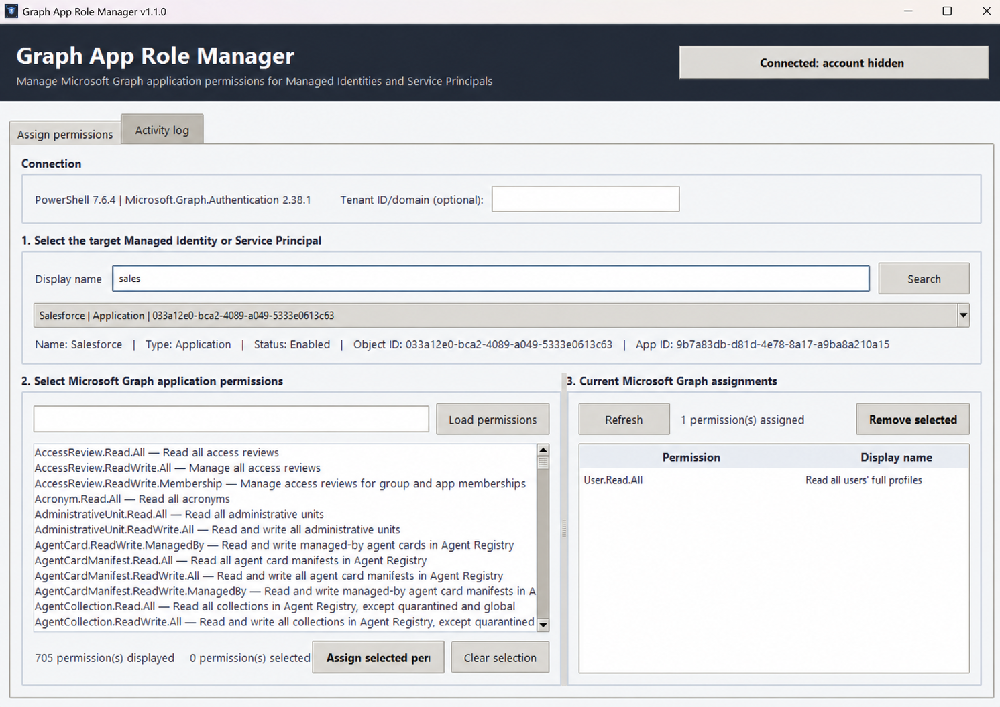
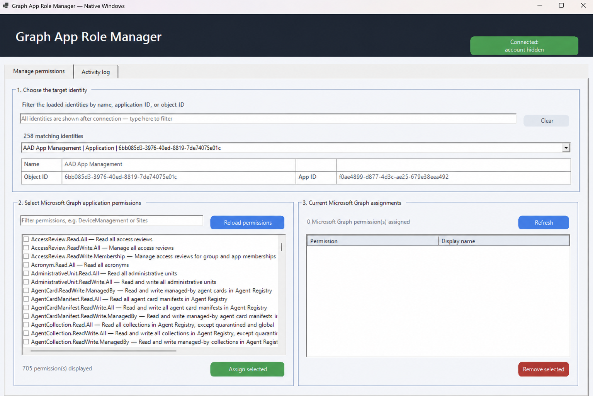

# Graph App Role Manager

[Version française](README.fr.md)

**Current cross-platform version: v1.1**

A graphical tool for inspecting, assigning, and removing Microsoft Graph application
permissions on managed identities and service principals.

The repository contains two interfaces:

- the recommended Python/Tkinter GUI for Windows, macOS, and Linux desktops;
- a native Windows PowerShell/Windows Forms alternative.

Both versions query the Microsoft Graph service principal directly, so the available
application-permission catalog stays aligned with the tenant instead of being hard-coded.

## Features

- Authenticate interactively with Microsoft Entra ID.
- Search managed identities and service principals by display name.
- Browse and filter enabled Microsoft Graph application permissions.
- Display the Microsoft Graph app roles currently assigned to the selected identity.
- Assign several permissions in one operation while avoiding duplicates.
- Remove selected assignments after an explicit confirmation.
- Filter a tenant-wide identity list locally or run a server-side display-name search.
- Keep permission selections while changing the permission filter.
- Use a dedicated device-code sign-in dialog on Windows to avoid WAM window-handle errors.
- Use the refreshed cross-platform interface with clearer controls and tables.
- Use a responsive native Windows interface with matching visual structure.
- Keep an activity log and show a completion summary.
- Store no password, client secret, certificate, or access token on disk.

## Choose a version

| Version | Best for | Authentication | Requirements |
| --- | --- | --- | --- |
| **[Cross-platform Python GUI v1.1](cross-platform/graph_app_role_manager.py) (recommended)** | Windows, macOS, or Linux desktops | Device code on Windows; interactive browser on macOS/Linux | Python 3.10+, Tkinter, PowerShell 7, `Microsoft.Graph.Authentication` |
| [Native Windows PowerShell GUI](windows/Graph-App-Role-Manager.ps1) | Windows administrators who prefer a PowerShell-only interface | Interactive `Connect-MgGraph` | Windows, PowerShell 7+, Microsoft Graph modules |

The cross-platform version does not require a custom App Registration, client ID, client
secret, certificate, or additional Python packages.

## Screenshots

### Cross-platform GUI (recommended)



### Native Windows PowerShell GUI



> **Interface scope:** The GUIs intentionally prioritize reliable Microsoft Graph
> operations, clarity, portability, and native-toolkit compatibility over a highly
> customized visual design. Tkinter and Windows Forms inherit much of their appearance
> from the operating system and offer less visual flexibility than a modern web interface.
> Further cosmetic refinement is therefore not a primary project goal; safe and correct
> permission management remains the priority.

## Required delegated permissions

The signed-in session requests:

- `Application.Read.All`
- `AppRoleAssignment.ReadWrite.All`

These are powerful administrative permissions. Administrator consent and an appropriate
Microsoft Entra role are required. Review
[Permissions and safety](docs/permissions-and-safety.md) before using the tool.

## Quick start

### Cross-platform (recommended)

```bash
pwsh -NoProfile -Command "Install-Module Microsoft.Graph.Authentication -Scope CurrentUser"
python cross-platform/graph_app_role_manager.py
```

Keep `graph_app_role_manager.py`, `graph_backend.ps1`, and
`graph-app-role-manager-icon.png` together. The tenant field is optional. See the
[cross-platform setup guide](docs/cross-platform.md) for OS-specific prerequisites and
troubleshooting.

### Native Windows alternative

```powershell
pwsh -File .\windows\Graph-App-Role-Manager.ps1
```

The native interface can offer to install missing Microsoft Graph modules for the current
user, but it asks for confirmation first.

## Safe operating sequence

1. Connect with an authorized administrator account.
2. Search for the target identity.
3. Verify its display name, object ID, application ID, and type.
4. Inspect existing assignments.
5. Select only the application permissions required by the workload.
6. Read the confirmation dialog before assigning or removing anything.
7. Verify the resulting assignments in the interface and Microsoft Entra admin center.

## Documentation

- [Architecture](docs/architecture.md)
- [Windows setup](docs/windows.md)
- [Cross-platform setup](docs/cross-platform.md)
- [Permissions and safety](docs/permissions-and-safety.md)

Documentation screenshots use a hidden account label. Avoid publishing real administrator
accounts, tenant domains, or other sensitive tenant information in future screenshots.

## Scope

This tool manages **Microsoft Graph application permissions** represented by app-role
assignments on service principals. It does not manage delegated user consent, Entra
directory-role assignments, Azure RBAC, or SharePoint `Sites.Selected` site grants.

## License

Released under the [MIT License](LICENSE).
