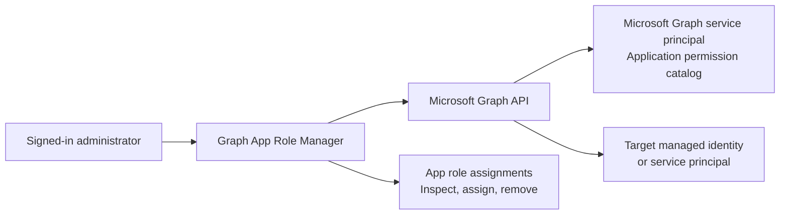

# Architecture

## Object model

Microsoft Graph itself is represented in each tenant by a service principal whose
application ID is `00000003-0000-0000-c000-000000000000`. Its enabled app roles with
`Application` in `allowedMemberTypes` form the permission catalog displayed by the tool.

An assignment links:

- the target service principal as `principalId`;
- the Microsoft Graph service principal as `resourceId`;
- the selected Graph permission as `appRoleId`.

## Windows implementation

The Windows version uses Microsoft Graph PowerShell:

- `Connect-MgGraph` for interactive delegated authentication;
- `Get-MgServicePrincipal` for search and permission discovery;
- the app-role-assignment cmdlets to inspect, create, and remove assignments.

## Cross-platform implementation

The Python version uses:

- Tkinter for the desktop interface;
- a persistent PowerShell 7 child process and a line-oriented JSON protocol;
- `Connect-MgGraph` with device-code authentication on Windows, where the headless backend
  cannot provide Web Account Manager with a parent window handle;
- `Connect-MgGraph` interactive-browser authentication on macOS and Linux;
- `Invoke-MgGraphRequest` for Microsoft Graph `v1.0` operations.

The PowerShell authentication context is process-scoped and disconnected when the
interface closes. The application does not create its own token cache or handle raw access
tokens in Python. On Windows, the backend sends the temporary verification URL and code to
the GUI over the existing JSON protocol.

## Safety boundaries

- The target identity is selected from search results rather than inferred from a name.
- Object and application IDs are displayed before changes are made.
- Existing assignments are loaded before assignment to avoid duplicates.
- Both assignment and removal require an explicit confirmation.
- Removal is limited to assignments whose resource is Microsoft Graph.
